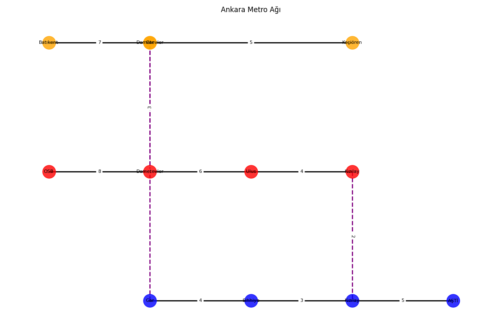

# Metro Simülasyonu ve Rota Hesaplama

Bu proje, Ankara metrosu üzerinden çeşitli rota hesaplama ve analizlerini gerçekleştiren bir simülasyondur. Hem en az aktarmalı hem de en hızlı (seyahat süresi bazlı) rotaları bulmak için farklı algoritmalar kullanılmıştır.

---

## Kullanılan Teknolojiler ve Kütüphaneler

- **Collections Modülü**
  - **defaultdict:** Metro hatlarına ait istasyonları listelemek için, varsayılan değere sahip sözlükler oluşturmak amacıyla kullanılmıştır.
  - **deque:** Breadth-First Search (BFS) algoritması uygulanırken çift yönlü kuyruk yapısı oluşturmak için tercih edilmiştir.
- **Heapq Modülü**
  - A* algoritması kapsamında, en düşük seyahat süresine sahip istasyonu önceliklendirerek priority queue implementasyonu sağlamak için kullanılmıştır.
- **Typing Modülü**
  - Kodun okunabilirliğini ve statik tip kontrolünü artırmak amacıyla "type hint" desteği sunar.
- **Matplotlib**
  - Metro ağının görsel temsili için, istasyonlar, hatlar ve rota detaylarını farklı renk ve çizgi stilleriyle çizmek için kullanılmıştır.
- **NetworkX**
  - Metro ağı verisinin düğümler (istasyonlar) ve kenarlar (bağlantılar) şeklinde modellenmesini, analizini ve görselleştirilmesini sağlar.
- **Random**
  - İhtiyaç duyulduğunda istasyonların koordinatlarını rastgele (ancak anlamlı) belirlemek için destek sunar.
- **Math**
  - Çeşitli matematiksel fonksiyonların kullanımını sağlar

---

## Genel Yapı ve Tasarım

### Rotanın Hesaplanması

- **en_az_aktarma_bul**
  - **Algoritma:** Breadth-First Search (BFS)
  - **Adımlar:**
    1. Başlangıç istasyonunu içeren bir kuyruk (deque) oluşturulur.
    2. Ziyaret edilen istasyonlar `set` ile takip edilir.
    3. Her istasyonun tüm komşuları analiz edilir.
    4. Hedefe ulaşan ilk rota, BFS’nin seviye seviye ilerlemesi sayesinde minimum aktarma içeren rota olarak döndürülür.

- **en_hizli_rota_bul**
  - **Algoritma:** A* Algoritması
  - **Adımlar:**
    1. En düşük seyahat süresine sahip istasyonu önceliklendirmek için priority queue (heapq) kullanılır.
    2. Her istasyona ulaşmak için gereken en kısa süreler kaydedilir.
    3. Komşu istasyonlar üzerinden yeni toplam süre hesaplanır.
    4. Hedef istasyona ulaşıldığında, rota ve toplam seyahat süresi geri döndürülür.
  - **Not:** Projede, kendi oluşturulan basit sezgisel yöntem sayesinde A* algoritması daha işlevsel hale getirilmiştir.

### Ek Fonksiyonaliteler

- **Koordinat Hesaplama**
  - İstasyonlara, görsel temsili kolaylaştırmak amacıyla x, y koordinatları atanır.
  - Her hat farklı y konumlarında, istasyonlar ise sıralarına göre x koordinatında yerleştirilir.
  - Aktarma noktalarında, farklı hatlardan gelen koordinatlar ortalanarak uyumlu bir yerleşim sağlanır.

- **Grafik Çizme**
  - NetworkX ve Matplotlib kullanılarak metro ağı grafiksel olarak çizilir.
  - **Düğüm Renkleri:** İstasyonlar, ait oldukları hatların belirlenen renkleriyle temsil edilir.
  - **Kenar Stilleri:** Normal hat bağlantıları düz çizgi; farklı hatlar arası (aktarma) bağlantılar ise noktalı çizgi ve vurgulu renklerle gösterilir.
  - **Rota Vurgulama:** Hesaplanan rota, başlangıç ve bitiş istasyonları gibi önemli noktalar farklı renk ve kalınlıklarla vurgulanır.

- **Rota Detaylarının Gösterimi**
  - Hesaplanan rotada her istasyonun adı, hat bilgisi, aktarma noktaları ve iki istasyon arasındaki seyahat süresi detaylı olarak yazdırılır.
  
- **Ağ Analizi**
  - Tüm istasyon çiftleri arasındaki rotalar analiz edilerek ortalama seyahat süresi, toplam aktarma sayısı gibi istatistikler hesaplanır.
  - En kalabalık (bağlantı sayısı en yüksek) istasyonlar belirlenir.
  - En uzun seyahat süresine sahip rota tespit edilip görsel olarak vurgulanır.

---

## Test Senaryoları

### 1. AŞTİ'den OSB'ye
- **En az aktarmalı rota:**  
  `AŞTİ -> Kızılay -> Kızılay -> Ulus -> Demetevler -> OSB`
  - **Detaylar:**  
    - Başlangıç: AŞTİ (Mavi Hat)
    - Kızılay’da aktarma (Mavi'den Kırmızıya): 5 + 2 dakika
    - Ulus: 4 dakika
    - Demetevler: 6 dakika
    - OSB: 8 dakika
  - **Toplam:** 6 istasyon, 1 aktarma
- **En hızlı rota (25 dakika):**  
  Aynı rota, toplam süre 25 dakika

  
  

### 2. Batıkent'ten Keçiören'e
- **En az aktarmalı rota:**  
  `Batıkent -> Demetevler -> Gar -> Keçiören`
  - **Detaylar:**  
    - Başlangıç: Batıkent (Turuncu Hat)
    - Demetevler: 7 dakika
    - Gar: 9 dakika
    - Keçiören: 5 dakika
  - **Toplam:** 4 istasyon, 0 aktarma
- **En hızlı rota (21 dakika):**  
  Aynı rota, toplam süre 21 dakika

  
  

--- 
Ek senaryolar

### 3. Keçiören'den AŞTİ'ye
- **En az aktarmalı rota:**  
  `Keçiören -> Gar -> Gar -> Sıhhiye -> Kızılay -> AŞTİ`
  - **Detaylar:**  
    - Başlangıç: Keçiören (Turuncu Hat)
    - Gar’da aktarma (Turuncu'dan Maviye): 5 + 2 dakika
    - Sıhhiye: 4 dakika
    - Kızılay: 3 dakika
    - AŞTİ: 5 dakika
  - **Toplam:** 6 istasyon, 1 aktarma
- **En hızlı rota (19 dakika):**  
  Aynı rota, toplam süre 19 dakika

  
  

### 4. OSB'den Batıkent'e
- **En az aktarmalı rota:**  
  `OSB -> Batıkent`
  - **Detaylar:**  
    - OSB’de aktarma (Kırmızı Hat’ten Turuncu Hat’e)
    - Batıkent: 20 dakika
  - **Toplam:** 2 istasyon, 1 aktarma
- **En hızlı rota (18 dakika):**  
  `OSB -> Demetevler -> Demetevler -> Batıkent`
  - **Detaylar:**  
    - OSB: Başlangıç (Kırmızı Hat)
    - Demetevler üzerinden aktarma (Kırmızı’dan Turuncuya): 8 + 3 dakika
    - Batıkent: 7 dakika
  - **Toplam:** 4 istasyon, 1 aktarma

  
  

### 5. Kızılay'dan Keçiören'e
- **En az aktarmalı rota:**  
  `Kızılay -> Keçiören`
  - **Detaylar:**  
    - Kızılay’da aktarma (Kırmızı Hat’tan Turuncu Hat’e)
    - Keçiören: 15 dakika
  - **Toplam:** 2 istasyon, 1 aktarma
- **En hızlı rota (15 dakika):**  
  Aynı rota, toplam süre 15 dakika

 

  
  

### Ağ Analizi
- **En Kalabalık İstasyonlar:**  
  - Demetevler (Kırmızı Hat) – 3 bağlantı  
  - Kızılay (Mavi Hat) – 3 bağlantı  
  - Demetevler (Turuncu Hat) – 3 bağlantı
- **Genel İstatistikler:**  
  - Toplam İstasyon Çifti: 66  
  - Ortalama Seyahat Süresi: ≈12.86 dakika  
  - Ortalama Aktarma Sayısı: ≈0.88
- **En Uzun Rota:**  
  - AŞTİ -> Batıkent (27 dakika)

---